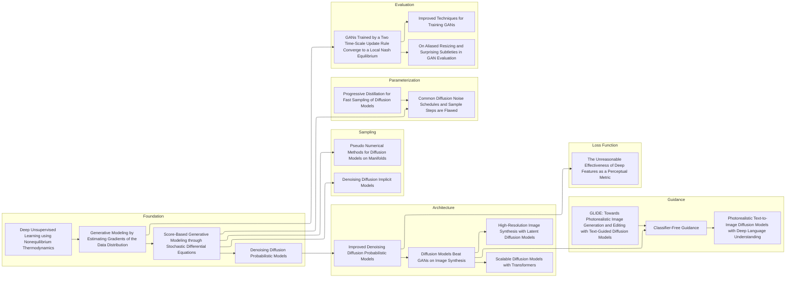

# Human Faces Generation with Diffusion Models 🫥
**EEEM068 Spring 2025 Applied Machine Learning Project**: Human Faces Generation with Diffusion Models. The project's model runs are available on Weights & Biases [here](https://wandb.ai/frankcholula/faice). Project planning documentation can be accessed [here](https://frankcholula.notion.site/faice?pvs=4), and a webpage of the final paper is available [here](https://frankcholula.notion.site/diffusion-paper?pvs=4) and in pdf form [here](code/papers/difusion_paper.pdf).


## 📚 Literature Review

For diffusion literature references, please consult the Zotero-synced Notion table [here](https://frankcholula.notion.site/diffusion-literature?v=1e03b40fbcd5806da3c9000c8c33c842&pvs=4).

## 💻 Code Layout
```bash
faice/code
├── args.py
├── assets
├── conf
│   └── training_config.py
├── datasets
│   ├── celeba_hq_split
│   └── celeba_hq_stable_diffusion
├── eda
│   └── Training_Diffusion_Models.ipynb
├── experiments
│   ├── task1
│   ├── task2
│   ├── task3
│   ├── task4
│   ├── task5
│   ├── task6
│   └── task7
├── main.py
├── Makefile
├── models
│   ├── transformer.py
│   ├── unet_resnet.py
│   ├── unet_with_pretrain.py
│   ├── unet.py
│   ├── vae.py
│   └── vqmodel.py
├── pipelines
│   ├── base_pipeline.py
│   ├── ccddpm_pipeline.py
│   ├── consistency.py
│   ├── custom_pipelines.py
│   ├── dit_vae.py
│   ├── dit.py
│   ├── ldmp.py
│   ├── lora_inference.py
│   ├── stable_diffusion.py
│   ├── train_text_to_image_lora.py
│   ├── vae_train.py
│   └── vqvae_train.py
├── test
│   ├── test_stable_diffusion.py
│   ├── test_vae.py
│   └── test_vqvae.py
└── utils
    ├── loggers.py
    ├── loss.py
    ├── metrics.py
    ├── model_tools.py
    ├── plot.py
    ├── training.py
    └── transforms.py
```

## 🧪 Running the Experiments
⚠️ **Please first request for cluster access to `Eureka2` and `Otter` from the CSEE department. Otherwise, there's an `Otter Setup` documentation [here](https://frankcholula.notion.site/otter-setup?pvs=4).**

Please design the experiments according to your tasks and put them in the  `experiments` folder accordingly. You have the option to use the `Makefile` as well. 
```bash
python main.py \
    --dataset face \
    --scheduler ddpm \
    --beta_schedule linear \
    --model unet \
    --unet_variant ddpm \
    --image_size 128 \
    --num_epochs 500 \
    --train_batch_size 64 \
    --eval_batch_size 64 \
    --wandb_run_name baseline \
    --calculate_fid \
    --calculate_is \
    --verbose
```
Given that runs are computationally expensive, I recommend using the `--verbose` flag to check your parameters before running the experiments.

⚠️ **Unless you're running hyperparameter tuning, please make sure yoru experiement batch size is consistent for the ablation study**
1. If you're running the experiments on `Otter`, please lock the batch size to `24` or `16` for memory reasons. 
2. If you're running the experiments on `Eureka2`, please set the batch size to `64` for faster training.

After you've run the experiments, please documen the results in the Notion [page](https://frankcholula.notion.site/faice?pvs=4).

## 🧑‍🍳 Dataset Preparation
For **unconditional generation**, please download the attached dataset `celeba_hq_split.zip` from the email and extract it into the `datasets` folder in order to run the code.

For **conditional generation**, please download the dataset sent in the WhatsApp group. The layout of your dataset should be as follows:
```bash
code/datasets
├── celeba_hq_split
│   ├── test
│   ├── train
│   ├── celebaAHQ_test.xlsx
│   └── celebaAHQ_train.xlsx
└── celeba_hq_stable_diffusion
    ├── captions_hq.json
    ├── request_hq.txt
    ├── test_300
    └── train_2700
```


## ㊙️ Credentials
🚨 **DO NOT COMMIT THE CREDENTIALS**
Please use the provided API key and entity in the `.env` file in order to store the runs on Weights & Biases.
```bash
# sample .env file
WANDB_ENTITY=<your_wandb_entity>
WANDB_API_KEY=<your_wandb_api_key>
```

## License
This project is licensed under the [GNU General Public License v3.0](https://www.gnu.org/licenses/gpl-3.0.en.html) (GPL-3.0). This means:
1.	**Attribution**: You must give appropriate credit to the original author (me, [Frank Lu](https://frankcholula.notion.site/)) if you use or modify this project.
2.	**Non-Proprietary**: Any derivative works or modifications must also be shared under the same license. This project cannot be used in proprietary or closed-source software.
3.	**Open Source Forever**: Any modifications you make must remain open-source under the GPL-3.0 license. This helps ensure the code remains accessible and beneficial to everyone.

You can read the full license in the [LICENSE](LICENSE) file.